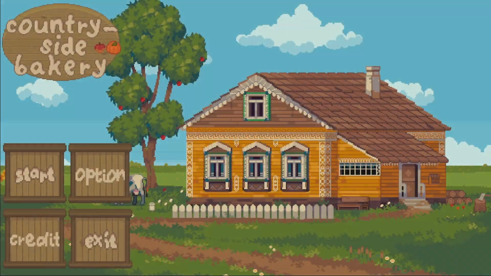
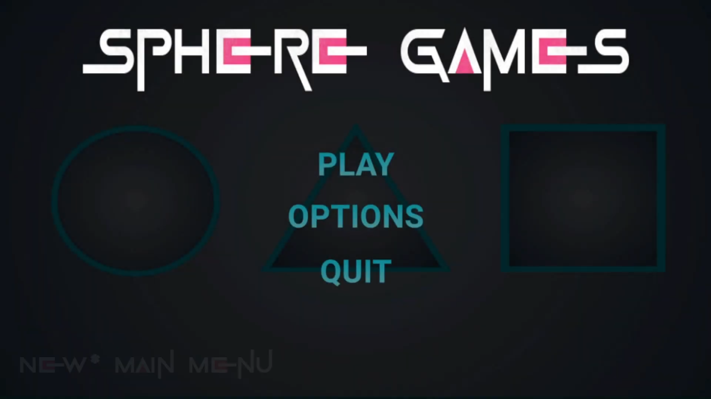
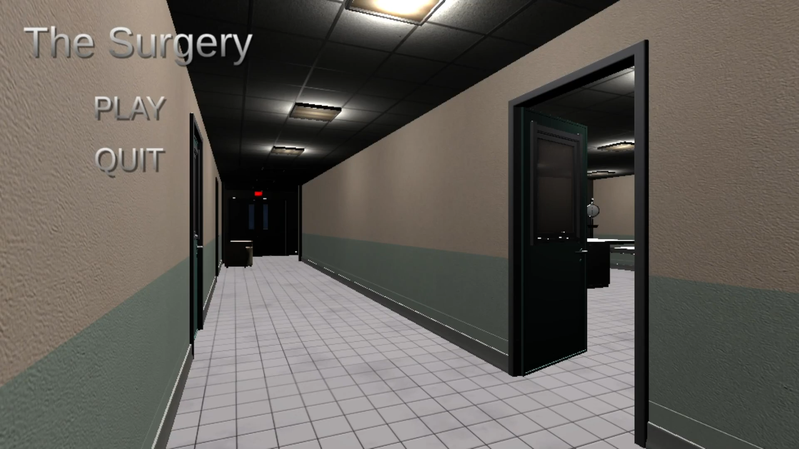
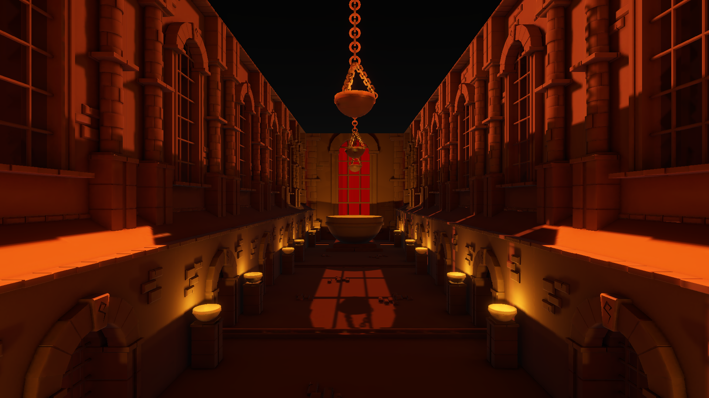

## About Me 
Hey, I'm Xander. I'm currently a second-year student at NSCC Truro, studying Game Programming.

I started making games when I was 11 using Scratch, and have since moved on to C# and Unity. Since then, I've worked on a variety of projects, ranging from 2D and 3D Unity games to simple console programs.

I mainly code in C#, but in the past I also have coded in; 
- Python
* JavaScript
+ HTML & CSS (if you count that as coding)

During my studies, I'm mainly focused on improving my programming skills and becoming more familiar with the Unity Editor.

## Current Projects
### [Roll A Ball 2](https://github.com/Doeugh/RollABall2)
> **Built with:** Unity · C#
> 
> This project returns to the concept of using Unity's Roll A Ball tutorial and expanding on it

## Past Projects 
### [Country-Side Bakery](https://github.com/Doeugh/GameEngFinal) 
> **Built with:** Unity · C#
> 
> A small 2d game where the player collects ingredients for their bakery

### [Sphere Games](https://github.com/Doeugh/Roll_A_Ball) 
> **Built with:** Unity · C#
> 
> A project based on Unity's Roll a Ball Tutorial

### [The Surgery](https://github.com/Doeugh/Triggered_Events)
> **Built with:** C#
> 
> A small horror game where the player navigates through a eerie hospital looking for organs

### [Playable RPG](https://github.com/Doeugh/RPGPlayable)
> **Built with:** C#
> 
> A small console RPG game

## Media Links
### [Youtube Channel](https://www.youtube.com/@Xander-GameDev) 
> Main Channel

### Country-Side Bakery Gameplay

> Full Gameplay Walkthrough for Country-Side Bakery

### Sphere Games Gameplay

> Latest Update for Sphere Games

### The Surgery Gameplay

> Full Gameplay Walkthrough for The Surgery

## Image Gallery

From my Baked Lighting Test

More coming soon...

## Contact Me
Email me at DoucetteXander@gmail.com

<!--
**Xd0uc3tt3/Xd0uc3tt3** is a ✨ _special_ ✨ repository because its `README.md` (this file) appears on your GitHub profile.

Here are some ideas to get you started:

- 🔭 I’m currently working on ...
- 🌱 I’m currently learning ...
- 👯 I’m looking to collaborate on ...
- 🤔 I’m looking for help with ...
- 💬 Ask me about ...
- 📫 How to reach me: ...
- 😄 Pronouns: ...
- ⚡ Fun fact: ...
-->
